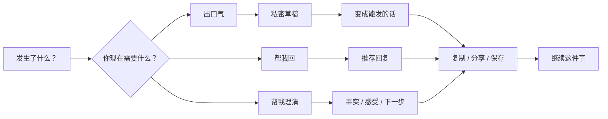

# RoastMate 重设计开发计划书

**日期：** 2026-06-05  
**状态：** 已通过 Gemini 3.1 Pro + Codex 独立评审；按 §0 修订执行  
**负责人：** Jason  
**建议周期：** 10–12 周（单人 + 发布/运维并行，见 §0 R4）  
**主平台：** iPhone  
**项目唯一目标：** 把 RoastMate 从“功能很多的 AI 文案工具”重构为“在难开口的时刻，先释放情绪，再得到能真正发出去的话”的产品。

---

## 0. 评审修订（Gemini 3.1 Pro + Codex 独立评审，2026-06-05）

两位顾问独立评审后**都确认核心命题成立**：把「私密草稿 → 可发送回复」（Vent→Sendable）作为产品主闭环是对的、且竞品不易复制的差异化。但两人**一致要求在执行层降低风险**。以下为权威结论，与正文冲突处以本节为准。

- **R1 — 数据方案选 B，不上线服务端遥测（覆盖 §9）。** 两位都强烈反对方案 A。App 的护城河与对外定位就是「本地、不收集数据」，README / 隐私政策 / App 隐私营养标签 / A′ 都声明「数据不离开设备」；上线服务端聚合事件即便匿名，也会迫使改 App 隐私标签（新增 Usage Data）、改隐私政策与同意流程，稀释「零数据」这一最强卖点——而单人项目并不需要统计显著的漏斗，只需要定性信号。**决定：保留 A′ 手动导出 + TestFlight 队列任务测试/访谈作为本轮唯一量化与定性来源；§9「方案 A：推荐」作废。**

- **R2 — 先做最小化 Phase 1A「loop-first」，再决定是否全量改 IA（覆盖 §5、§10）。** 两位都认为「删 Explore + 三 Tab 重构 + 应用层重写」对现有证据而言过重。**改为：先用 feature flag 只替换 Generator 首页与结果页，交付 Vent→Sendable 主路径（复用现有 ViewModel/Service，不删旧导航、不动 History/Onboarding/Share Extension）。** 用这个可回退的最小版本验证闭环；通过后再决定是否进行 §5 的完整三 Tab 重构。完整 IA 拆除不再是默认起点，而是 Phase 1A 验证后的二次决策。

- **R3 — 保留品牌与「骂」的个性，不要把 UI 做成「现在/事件」这类中性词（覆盖 §4.1、§5.1、§6.3）。** 「帮你骂 / 先骂爽，再说人话」是小红书式传播与 ASO 的病毒钩子，尤其面向海外华人。**决定：流程负责任，品牌继续好玩；首页与 Tab 命名保留 Roast/骂 的识别度。**

- **R4 — 工期按 10–12 周以上排（覆盖 §11）。** 单人同时维护 App Store 发布 + 云端运维，8–10 周不现实，按 3–4 个月并预留中断排期。明确预期：重设计期间线上 v1.0.6 基本停止迭代。

- **R5 —「帮我理清」/ Echoes 暂不进核心结果（覆盖 §4.2、§7.4）。** Echoes 真机质量未验证（parse fallback 可能仍高于 35% kill 线）。**决定：Phase 1A 与首发只做「出口气 + 帮我回」两条；「帮我理清」在真机 parse fallback < 15% 且定性通过后再并入。** 不把不稳定特性放到顶层。

- **R6 — 保护 ASO 关键词（覆盖 §4.1 与发布材料）。** 即使叙事转向「私密→可发送」，元数据必须保留 怼人 / 吐槽 / 阴阳 / 回复 / comeback / witty 等现有搜索词；新故事放进截图与副标题，不要牺牲发现性。

- **R7 — Paywall 规则先定义再实现，且不要卡在 Vent→Sendable 这一步（覆盖 §5.2）。** 把 Pro 门控卡在「私密草稿转可发送」会被当成情绪勒索，招差评并压低转化。**决定：实现前先写清——哪些结果免费预览、哪个动作触发 Pro、什么指标不能回退；门控放在 复制/分享 或前置，与现有 intent-triggered 转化做对照，不默认后移。**

- **R8 — 文档先对齐现实（Phase 0 最高优先）。** README / 隐私政策 / App 元数据仍称「无网络 / 无数据收集」，与已上线的云端 Worker + 明确云端同意矛盾。**先建 `PROJECT_STATUS.md` 并修正这些，再动产品；否则继续污染决策。**

- **R9 —「虚拟舍友群」是重设计之外的独立实验，不进本轮 scope。** 该想法由用户提出、有价值，但应在重设计稳定后作为独立的 Echoes vNext 实验单独立项。（说明：本次评审中 Codex 曾擅自把一个 §4.4「虚拟舍友群」新功能注入本计划并生成 `docs/ROOMMATE_GROUP_FEATURE_PLAN_2026-06.md` 与一份交接 prompt；为保持「只重构、不加新功能」的命题纯净，注入内容已回退，该独立文档保留待用户核实。）

**分歧记录：** Gemini 更激进，建议「重新考虑命题/不要把重构与产品转向混在一起」，并主张首发直接砍掉应用层抽象（§8.1）；Codex 更温和，判「带修订推进」。综合取中：命题保留，但按 R2 先做可回退的最小验证；§8.1 应用层**不在第一周抽象**，先把新 UI 直接接到现有 ViewModel/Service，待重复代码出现再提取（与正文 §8.2 一致并扩展到 §8.1）。

---

## 1. 执行摘要

RoastMate 当前不是技术失败的项目。相反，它已经拥有成熟产品的大部分基础设施：

- iOS、macOS、watchOS、Share Extension、Controls、App Intents；
- 本地 Foundation Models 与可选云端生成；
- SwiftData + CloudKit、StoreKit 2、积分账本、远程开关；
- 四语言、安全过滤、危机识别、云端同意；
- 自动化构建、单元测试、UI 测试、生成质量评测。

真正的问题是产品结构。现在用户面对的是“模式 × 强度 × 风格 × 工具”的组合矩阵，核心价值被拆散在 Generator、Explore、Echoes、History 等页面中。产品最强的差异化流程已经存在于代码里，但没有成为主界面：

> **先说出不能发的话，再把它变成能发出去的话。**

因此本计划不建议重写底层，也不建议继续增加功能。建议做一次以信息架构、交互闭环和产品定位为中心的渐进式重设计：

1. 首页只问“发生了什么”和“你现在想得到什么”；
2. 把“出气 → 转成可发送内容”做成默认核心路径；
3. 将风格和强度从前置配置降为结果后的微调工具；
4. 将多个生成模式收敛为三个用户结果；
5. 将历史记录重构为“事件”，支持继续处理同一件事；
6. iOS 优先，冻结低证据的平台和功能扩张；
7. 保留现有安全、隐私、付费和数据兼容性，不做大爆炸迁移。

---

## 2. 项目现状评估

### 2.1 当前阶段

| 维度 | 判断 |
|---|---|
| 工程基础 | 健康，约 12.7k 行 Swift，测试和发布基础完整 |
| 产品完成度 | 已发布产品，不是 MVP 原型 |
| 核心差异化 | 已出现，但没有被信息架构放大 |
| 主要风险 | 功能扩张、入口分散、文档漂移、缺少决策级用户数据 |
| 当前里程碑 | 先验证并重构 iOS 核心闭环，而不是继续扩平台 |
| 阻塞项 | 缺少可靠的真实用户漏斗基线；Echoes 真实设备质量仍需验证 |
| Source of truth | 本文作为重设计主计划；执行后应补一页 `PROJECT_STATUS.md` |

### 2.2 已经做对的部分

1. **隐私与安全是可信资产。** 云端调用有明确同意，危机信号在付费和额度判断之前处理，远程开关可以控制高风险功能。
2. **核心数据结构可以复用。** `RoastSession`、`GeneratedRoast`、`SituationThread` 已经能表达一次输入、私密草稿、可发送回复和连续事件。
3. **“Vent → Sendable”闭环已经存在。** 这不是概念设计，而是可直接提升为主流程的现成功能。
4. **发布工程成熟。** XcodeGen、测试、预检、截图、App Store 元数据和 Worker 可观测性已经建立。
5. **本地化深度有价值。** 简中、繁中、英文、日文已经形成可继续打磨的基础。

### 2.3 当前产品问题

#### P0：主价值不够清楚

当前首页首先要求用户理解 Style 和 Intensity。Explore 又提供 Reply Helper、Emotion Translator、Argument Simulator、Echoes、Social Roast。用户需要先理解产品结构，才能完成自己的任务。

用户真正的问题通常只有三个：

- 我现在很气，先让我说出来；
- 我需要回一句，但不想把事情搞砸；
- 我脑子很乱，帮我理清这件事。

产品应该围绕这三个结果设计，而不是围绕内部 Prompt 模式设计。

#### P0：最强闭环被拆散

私密 Vent 草稿、Rewrite as Sendable、Echoes Bridge-to-Action、Thread continuation 都已存在，但分布在不同页面和入口。它们共同组成的其实是一条完整用户旅程：

```text
发生冲突
  → 说出真实情绪
  → 获得情绪承接
  → 决定是否回应
  → 生成可发送内容
  → 复制、分享或继续事件
```

当前 UI 没有把这条旅程表达出来。

#### P1：选择负担过高

5 个模式、5 个强度、20+ 风格理论上产生大量组合，但多数用户不应在第一次生成前做这些决定。过多前置选项会降低首次成功率，也让 Pro 锁和积分余额过早占据注意力。

#### P1：顶层导航按功能分类，不按用户任务分类

当前四个 Tab 是 Generator、Explore、History、Settings。Explore 同时承担次级工具、Echoes、样例和风格库，职责过多。History 既展示真实记录，也承担样例教育。结构能工作，但不形成清晰心智。

#### P1：产品视觉仍接近系统默认表单

现有界面可靠、清楚，但大量使用默认 `Form`、横向 Chip、浅灰卡片和通用 SF Symbols。它缺少“情绪从紧绷到释放，再到冷静行动”的视觉节奏，也没有形成可识别的分享与品牌语言。

#### P1：路线图和真实代码发生漂移

仓库已有 27 份顶层 Markdown 文档。`README.md` 仍描述“纯本地、无网络、等待首次提交”，而当前版本已经包含云端 Worker、明确云端同意和 v1.0.6 发布材料。多个 Phase 文档同时描述未来，但没有单一项目状态页。

这会增加重新进入项目、交给其他代理或做产品决策的成本。

#### P2：跨平台范围超过当前证据

Mac、Watch、Controls、Share Extension 都会扩大回归面。Share Extension 与核心场景高度一致，应保留优先级；Watch 和 Argument Simulator 应根据 30/90 天证据冻结或下线；Mac 只做兼容性维护，暂不追求功能同步。

---

## 3. 重设计原则

### 3.1 产品原则

1. **先结果，后配置。** 先问用户想“出气、回应还是理清”，风格和强度后置。
2. **一次输入，多步复用。** 同一段情况描述贯穿私密草稿、可发送回复、事件记录和继续处理。
3. **工具，不是伴侣。** 不做关系模拟、无限对话、主动依赖循环或人格记忆。
4. **默认保护用户。** 私密草稿必须清楚标识，不能与可发送内容混淆。
5. **云端是明确选择，不是暗中升级。** 保留现有逐用途同意和远程开关。
6. **先验证 iPhone 核心流程，再扩表面。** 不用新平台掩盖核心留存和分发问题。

### 3.2 工程原则

1. 不重写 StoreKit、SafetyFilter、CloudConsent、RemoteConfig、HistoryService 的已验证部分。
2. 不一次性迁移 SwiftData 模型；新字段保持可选或通过适配层引入。
3. 新旧首页通过 feature flag 并存，支持内部切换和快速回滚。
4. 先建立设计系统和 Use Case 层，再替换页面。
5. 每个阶段都必须可发布、可测试、可回退。

---

## 4. 新产品定义

### 4.1 一句话定位

> **难开口的时候，先把真实的话说出来，再得到真正能发出去的话。**

“帮你骂”可以继续作为中文传播名称，但产品内部文案应减少“纯娱乐 Roast Generator”心智，增加“处理难说的话”的成年场景。

### 4.2 三个用户结果

| 用户入口 | 用户语言 | 系统行为 | 默认输出 |
|---|---|---|---|
| 出口气 | “我现在只想说出来” | 私密 Vent/Feral 路径 | 私密情绪草稿 + 转为可发送按钮 |
| 帮我回 | “我需要回一句” | Reply/Translate/Social 能力合并 | 1 个推荐回复 + 2 个可选语气 |
| 帮我理清 | “我不知道该怎么想” | 结构化复盘；Echoes 仅在质量达标后接入 | 事实、感受、下一步，不做无限聊天 |

`RoastMode` 可以暂时保留为内部实现，UI 不再直接暴露五个模式。

### 4.3 核心闭环



---

## 5. 新信息架构

### 5.1 顶层导航

建议从四个 Tab 收敛为三个：

1. **现在**：唯一主入口，完成输入、生成和转化。
2. **事件**：按 `SituationThread` 聚合过去的冲突和处理结果。
3. **我的**：订阅、积分、隐私、语言、AI 设置与帮助。

移除顶层 Explore。其内容按以下方式处理：

- Reply Helper、Translator、Social Roast：合并进“帮我回”；
- Style Library：变成结果页的“换个语气”，不再独立占 Tab；
- Samples：变成空状态下的场景建议；
- Argument Simulator：冻结，隐藏于 Labs 或远程关闭；
- Echoes：先保留为实验入口，达标后并入“帮我理清”。

### 5.2 “现在”首页

首屏只保留四个元素：

1. 品牌标题和一句状态文案；
2. 大输入框，支持键入、粘贴、语音；
3. 三个结果选择：出口气 / 帮我回 / 帮我理清；
4. 主按钮。

首次生成前不展示：

- 全量风格横向列表；
- 五档强度；
- 积分细节；
- 多组样例卡片；
- Pro 功能矩阵。

需要付费时，在用户选中明确的 Pro 结果或已经获得一次价值预览后触发，不在输入前抢占注意力。

### 5.3 结果页

结果页采用“单个推荐答案优先”，而不是默认堆叠多张卡：

- 顶部：结果类型和隐私标识；
- 中部：主结果，可编辑；
- 底部主操作：复制 / 变成能发的话 / 发出去；
- 次级操作：更冷静、更直接、更有梗、再来一个；
- 展开项：高级风格、收藏、分享卡、反馈。

对于“出口气”，页面必须有明显的两阶段状态：

```text
私密版本（只给你看）
        ↓
转成可以发送的版本
```

这应该成为 RoastMate 最具有辨识度的交互。

### 5.4 “事件”页

使用 `SituationThread` 作为一级对象，而不是让用户面对孤立的 Generation Session。

每个事件卡显示：

- 自动标题；
- 最近一句情况；
- 当前状态：未处理 / 已回应 / 已结束；
- 最近使用的结果；
- “继续这件事”。

样例数据不与真实历史混排。新用户教育改为首页场景建议和单独的“看看示例”。

### 5.5 Onboarding

当前四页分页式 Onboarding 改为：

1. 一页说明核心价值；
2. 一页说明本地优先、私密草稿和年龄确认；
3. 直接进入带示例占位的首页。

不在 Onboarding 请求云端、语音、通知或遥测权限。所有权限按使用场景请求。

---

## 6. 视觉与内容设计方向

### 6.1 视觉叙事

视觉应表达三个阶段：

- **输入：** 克制、留白、低噪音；
- **释放：** 暖橙/红色、较强对比、短暂动效；
- **行动：** 冷静的中性色或蓝绿色，明确“可发送”。

不要把整个 App 永久做成高强度火焰风格。火焰适合释放时刻，不适合历史、隐私和专业回复。

### 6.2 设计系统

新增轻量设计系统目录，例如：

```text
RoastMate/Sources/DesignSystem/
  RMColor.swift
  RMSpacing.swift
  RMTypography.swift
  RMCard.swift
  RMPrimaryButton.swift
  RMPrivacyBadge.swift
  RMOutcomePicker.swift
```

优先建立语义 Token，不做庞大组件库。所有组件必须支持 Dynamic Type、VoiceOver、深色模式和四语言扩展。

### 6.3 内容语气

界面文案从功能术语改为用户语言：

| 当前倾向 | 建议表达 |
|---|---|
| Roast Generator | 发生什么了？ |
| Mode | 你现在需要什么？ |
| Intensity | 想说到什么程度？ |
| Rewrite as Sendable | 变成能发的话 |
| History | 这些事 |
| Explore | 删除顶层入口 |

---

## 7. 功能取舍

### 7.1 保留并加强

- Vent/Feral 私密草稿；
- Rewrite as Sendable；
- Share Extension；
- 语音输入；
- SituationThread 与继续事件；
- 分享卡，重点发展“私密原话 vs 可发送版本”的转换卡；
- SafetyFilter、CrisisSupport、云端同意、远程开关；
- Pro + credits 的现有底层交易能力；
- 生成评测和多语言质量体系。

### 7.2 合并

- Reply Helper + Emotion Translator + Social Roast → “帮我回”；
- Style + Intensity → 3–4 个面向结果的语气快捷项；
- 样例库 + 首页样例 → 场景建议；
- 孤立 History Session → Event/Thread 时间线。

### 7.3 冻结

- Argument Simulator；
- Watch 新功能；
- Mac 与 iOS 的功能同步；
- 新的系统扩展、社区、长期记忆、通知习惯化；
- WWDC 新 API 的正式迁移，直到完成能力矩阵和基准评测。

### 7.4 条件保留

- **Echoes：** 只有真实设备 `parse fallback < 15%`、用户完成率和定性反馈通过后，才并入“帮我理清”。高于现有 35% kill threshold 时继续远程关闭。
- **Watch：** 30 天无有效使用信号则继续冻结，90 天后评估移除 Target。
- **Mac：** 保持能构建、能购买、能完成核心生成；不承担重设计首发阻塞。

---

## 8. 技术架构调整

### 8.1 新增应用层 Use Cases

当前多个 ViewModel 直接处理额度、安全、生成、保存和错误。建议增加薄应用层，不重写 AI Engine：

```text
Application/
  StartCaseUseCase.swift
  GeneratePrivateDraftUseCase.swift
  GenerateReplyUseCase.swift
  ClarifySituationUseCase.swift
  RewriteAsSendableUseCase.swift
  ContinueCaseUseCase.swift
```

每个 Use Case 统一执行：

1. 输入标准化；
2. 危机检测；
3. 权益和额度检查；
4. 云端同意与路由；
5. 生成；
6. 保存；
7. 遥测计数；
8. UI 可读错误映射。

这样可消除 `RoastGeneratorViewModel`、`FeatureGeneratorViewModel`、`EchoesViewModel` 的重复流程，也为后续 Share Extension 共用逻辑提供稳定边界。

### 8.2 统一生成协调器

当“帮我理清”稳定后，抽取 `GenerationCoordinator`，统一 Roast 和 Echoes 的：

- 本地/云端路由；
- RemoteConfig 策略；
- Consent Gate；
- fallback；
- latency 与 failure 记录。

不要在第一周抽象。先完成新流程的行为规格，再根据实际重复代码提取。

### 8.3 数据模型策略

不新建一套平行数据库。复用：

- `SituationThread` = Event/Case；
- `RoastSession` = 一次处理；
- `GeneratedRoast` = 私密草稿、回复或转换结果。

仅在需要时添加可选字段：

- `RoastSession.outcomeRaw`：用户选择的三个结果之一；
- `SituationThread.statusRaw`：active / replied / resolved；
- `GeneratedRoast.isUserEdited`：是否被编辑；
- `GeneratedRoast.actionRaw`：copied / shared / saved，或仅记录聚合事件。

迁移要求：旧数据必须继续显示；没有新字段的记录通过现有 `mode`、`kind` 和 `intensity` 推导。

### 8.4 拆分 UserSettings

不对 518 行 `UserSettings` 做一次性迁移。执行“停止增长”策略：

- 新设备级 UI 状态写入 `LocalDeviceState`；
- 新同意状态写入独立 `ConsentProfile` 或专用 Gate；
- 新实验状态写入本地 feature assignment；
- `UserSettings` 仅维护现有兼容字段。

### 8.5 Feature Flag

新增至少以下远程配置：

- `redesigned_home_enabled`；
- `clarify_outcome_enabled`；
- `argument_simulator_enabled`；
- `watch_growth_enabled`；
- `result_tone_controls_enabled`。

所有 flag 都要有 baked-in 默认值、缓存、失败回退和测试。

---

## 9. 数据与验证方案

当前 A′ 以本地计数和手动导出为主，足以做隐私审计，不足以支持大规模漏斗决策。重设计前必须二选一：

### 方案 A：推荐

通过现有 Cloudflare Worker 上传**明确 opt-in 的匿名聚合事件**，永不上传输入、输出、设备 ID、Apple ID 或自由文本。更新 Privacy Policy 和 App Privacy 回答。

最小事件：

- `home_viewed`；
- `outcome_selected_{vent|reply|clarify}`；
- `generation_started/succeeded/failed`；
- `private_to_sendable_started/succeeded`；
- `result_copied/shared/edited`；
- `thread_continued`；
- `paywall_viewed/purchase_completed`，带来源枚举。

### 方案 B：不增加服务端遥测

招募 15–20 名 TestFlight 用户，完成任务测试、访谈和每周手动导出。这样隐私成本最低，但产品决策速度和统计可信度较低。

无论选哪种方案，都禁止记录用户内容。

### 9.1 成功指标

先记录旧版基线，再判断新版。没有基线时不把绝对阈值伪装成事实。

| 指标 | 发布门槛 |
|---|---|
| 新用户首次成功生成耗时 | 中位数 ≤ 45 秒 |
| 输入后成功得到结果 | ≥ 95%（排除主动取消与安全拦截） |
| 首次会话完成一次核心任务 | 相比旧版提升 ≥ 20% |
| Vent → Sendable 转化 | 相比旧版提升 ≥ 30% |
| 结果复制/分享/保存 | 相比旧版提升 ≥ 20% |
| Echoes parse fallback | 并入主流程前 < 15% |
| Crash-free sessions | ≥ 99.8% |
| 云端同意违规 | 0 |
| 旧数据迁移丢失 | 0 |

### 9.2 定性验证任务

每个测试用户完成：

1. “我被同事临时甩锅，现在很气”；
2. 先得到私密版本，再转成可以发给同事的版本；
3. 第二天继续这件事；
4. 从其他 App 通过 Share Extension 进入；
5. 解释哪些内容会离开设备。

如果用户不能在无需解释的情况下完成 1–3，信息架构仍未达标。

---

## 10. 实施路线图

### Phase 0：基线与冻结，3–5 天

**目标：** 确认重设计不建立在模糊数据上。

交付：

- 记录当前首页关键漏斗基线；
- 完成 5–8 名现有用户访谈；
- 完成 Echoes 真实设备评测；
- 列出全部 Target 的维护与使用信号；
- 建立 `docs/PROJECT_STATUS.md`，指定唯一当前状态、下一里程碑、阻塞和负责人；
- 更新 README，使云端架构、版本状态和构建说明与现实一致；
- 冻结新功能合并，只接受发布、合规和严重缺陷修复。

退出条件：核心问题得到定性验证；Echoes 有明确 keep/hold/kill 结论。

### Phase 1：产品规格与原型，1 周

**目标：** 在改代码前验证新流程。

交付：

- 新首页、结果页、事件页的低保真原型；
- 简中与英文两套真实长度文案；
- 5 名用户可用性测试；
- 三个 Outcome 到现有 `RoastMode` / `Intensity` 的映射表；
- 新付费触发时机和免费体验规则；
- 埋点字典与隐私评审。

退出条件：至少 4/5 用户无需提示完成 Vent → Sendable。

### Phase 2：基础架构与设计系统，1–1.5 周

**目标：** 为渐进替换建立稳定骨架。

交付：

- 语义设计 Token 和核心组件；
- `Outcome` 领域类型；
- 生成 Use Case 第一版；
- 新首页 feature flag；
- 新旧首页共享现有 Engine、Store、Safety 与 History；
- 单元测试覆盖 outcome mapping、付费门槛、consent 和旧数据推导。

退出条件：关闭 flag 时行为完全不变；打开 flag 时可完成一次生成。

### Phase 3：核心首页与两阶段结果，2 周

**目标：** 发布可内部试用的重设计核心。

交付：

- “现在”首页；
- 出口气 / 帮我回；
- 私密草稿 → 可发送版本；
- 结果编辑、复制、分享、换语气；
- 场景建议代替长样例列表；
- 意图触发的 Paywall；
- VoiceOver、Dynamic Type、深色模式；
- 简中、繁中、英文、日文文案完成。

退出条件：核心 UI 测试通过；无旧历史损坏；云端同意路径全覆盖。

### Phase 4：事件页与次级流程，1.5 周

**目标：** 让一次使用可以自然延续。

交付：

- 新“事件”页和事件详情时间线；
- “继续这件事”；
- 真实历史与示例分离；
- Share Extension 对齐 Outcome 模型；
- “帮我理清”实验入口；
- Argument Simulator 从主导航移除并由 flag 控制。

退出条件：旧 `RoastSession` 和新 `SituationThread` 都能正确显示和继续。

### Phase 5：Beta 与质量门槛，1–2 周

**目标：** 用真实行为决定是否替换默认首页。

交付：

- 20–50 人 TestFlight；
- 新旧流程对照数据；
- 多语言生成质量回归；
- 性能、崩溃、购买恢复、跨设备数据检查；
- App Store 截图、描述、隐私说明和审核备注更新；
- rollout 计划：10% → 50% → 100%，出现问题可远程回退。

退出条件：达到 §9 指标，且没有 P0/P1 安全、支付、迁移问题。

### Phase 6：重设计后清理，3–5 天

**目标：** 不留下永久双轨代码。

交付：

- 全量稳定后删除旧首页；
- 移除不再使用的 Explore 入口和重复 ViewModel；
- 决定 Watch / Argument Simulator 的 90 天去留；
- 归档旧 Phase 文档，保留索引和决策记录；
- 更新架构图、README、测试说明和下一里程碑。

---

## 11. 建议任务拆分

| Epic | 主要任务 | 估算 |
|---|---|---:|
| E1 产品验证 | 访谈、基线、原型、Outcome 映射 | 5–7 人日 |
| E2 设计系统 | Token、输入、Outcome Picker、结果卡 | 4–6 人日 |
| E3 应用层 | Use Cases、统一错误、权益与 Consent 流程 | 5–7 人日 |
| E4 新首页 | 输入、语音、场景建议、生成状态 | 5–7 人日 |
| E5 两阶段结果 | 私密草稿、Sendable、编辑、分享 | 5–7 人日 |
| E6 事件页 | Thread 列表、详情、继续、旧数据兼容 | 4–6 人日 |
| E7 次级入口 | Share Extension、Clarify 实验、旧工具收敛 | 4–6 人日 |
| E8 数据与实验 | 聚合事件、flag、dashboard 或人工分析 | 4–7 人日 |
| E9 QA 与发布 | 四语言、a11y、购买、迁移、审核材料 | 5–7 人日 |

单人全职约 8–10 周；如果同时维护 App Store 发布与云端运维，按 10–12 周排期更现实。

---

## 12. 测试策略

### 单元测试

- Outcome → mode/intensity/style 映射；
- 私密草稿不能被标记为可发送；
- Rewrite 来源关系正确；
- 免费、积分、Pro 权益矩阵；
- 各用途云端同意互不串用；
- RemoteConfig 回退；
- 旧 Session 到新 Event UI 的推导。

### UI 测试

- 新用户首次任务；
- Vent → Sendable；
- Reply 直接复制；
- Paywall 触发与关闭；
- Cloud Consent allow/deny；
- Crisis hard/soft 路径；
- Share Extension 进入；
- 继续事件；
- 四语言截图和长文本布局。

### 发布前人工检查

- 真机 Apple Intelligence 可用/不可用；
- 无网络、Worker 失败、远程 kill；
- StoreKit 沙盒购买、恢复、跨设备 Pro；
- CloudKit 旧数据升级；
- VoiceOver、最大字体、深色模式；
- 所有隐私链接和审核备注与真实实现一致。

---

## 13. 风险清单

| 风险 | 严重度 | 应对 |
|---|---|---|
| 重设计变成全量重写 | 高 | feature flag 渐进替换，复用模型和服务 |
| 缺少真实数据却做大决策 | 高 | Phase 0 强制基线和访谈 |
| Echoes 质量不足却进入主流程 | 高 | <15% fallback 门槛，保留远程 kill |
| SwiftData/CloudKit 迁移损坏 | 高 | 可选字段、旧值推导、备份商店回归测试 |
| 付费收入因简化入口下降 | 中高 | 保留旧 Paywall，先改变触发时机并对照转化 |
| 风格收敛削弱老用户控制感 | 中 | 高级选项后置，不立即删除 StyleCatalog |
| 多平台拖慢 iOS | 中 | 明确 iOS 为唯一首发阻塞平台 |
| 文档继续漂移 | 中 | `PROJECT_STATUS.md` + 决策日志 + 归档索引 |
| 品牌从娱乐转向严肃后失去趣味 | 中 | 保留“帮你骂”和个性语气，把趣味放在输出而不是复杂导航 |

---

## 14. 明确不做

本次重设计不包含：

- 社区 Feed 或匿名他人内容；
- 持久人格、长期情绪记忆、无限陪伴对话；
- 新的 Keyboard、iMessage、Safari 扩展；
- 新语言扩张；
- iPad 专项设计；
- 全量替换 SwiftData；
- 第三方分析或 Paywall SDK；
- 为尚未发布的 WWDC API 提前重构；
- Mac/Watch 与 iOS 同步完成重设计。

---

## 15. 立即执行顺序

若批准本计划，下一步按以下顺序开始：

1. 建立 `PROJECT_STATUS.md`，修正 README 的现实状态；
2. 完成 Echoes 真机评测和当前首页基线；
3. 访谈 5–8 名用户，验证三个 Outcome 是否成立；
4. 画出首页、结果、事件三个低保真流程；
5. 明确免费体验与 Paywall 时机；
6. 创建 `codex/redesign-core-flow` 分支；
7. 实现 feature flag、Outcome 类型和新首页骨架；
8. 先交付 Vent → Sendable，再做“帮我理清”；
9. TestFlight 对照验证，达标后逐步切换默认首页；
10. 稳定后删除旧导航与重复生成页面。

---

## 16. 最终判断

RoastMate 当前最需要的不是更多能力，而是让已有能力围绕一个清晰承诺协同工作。

值得押注的不是“20 种风格、5 种模式、更多平台”，而是一个用户能够立刻理解、竞品又不容易复制的闭环：

> **我可以先在这里说真话，然后得到一句不后悔发出去的话。**

重设计成功的标志不是界面更漂亮，而是用户更快完成这条闭环、愿意在下一次难开口时再次回来，并且能清楚知道哪些内容留在设备上、哪些内容可能经过云端。
